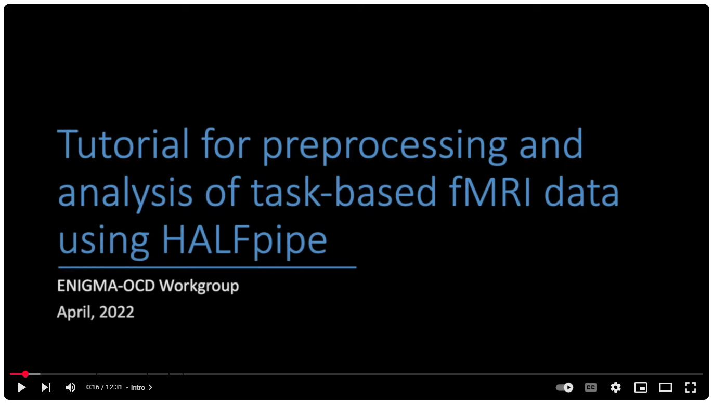
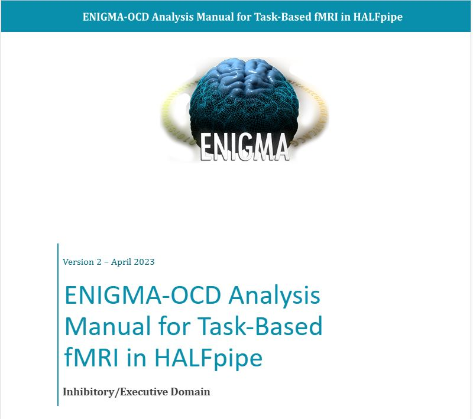

# Task-based fMRI mega-analyses in ENIGMA-OCD Working Group

This manual guides you through completing group-level analyses on individual participant task fMRI data. It was designed as a processing pipeline within the [ENIGMA-OCD consortium](https://enigma.ini.usc.edu/ongoing/enigma-ocd-working-group/). The principles of the consortium are that no raw data is shared, and that only processed and de-identified clinical and brain imaging data are shared with the lead site who carries out analyses. Therfore, this guide takes you through group-level analyses on already-processed first-level contrast maps using custom scripts and Bayesian multilevel models for regional and whole-brain analysis.

## Preprocessing

All raw data for the task-based fMRI analyses in ENIGMA-OCD has been processed using [HALFpipe](https://github.com/HALFpipe/HALFpipe) (Waller et al., 2022), an open-source containerized processing pipeline that was used for pre-processing and first-level feature extraction. This [manual] explains how to process task data using the pipeline and 

  

  <em>Tutorial video for HALFpipe preprocessing:</em> 
  <a href="https://www.youtube.com/watch?v=zruXn-JLE5c">Watch on YouTube</a>

  <table style="border-collapse: collapse;">
    <tr>
      <td width="500" valign="middle" align="center" style="padding: 10px;">
         
        <em>Manual for running group-level analyses</em> 
        <a href="https://docs.google.com/document/d/1kQ0o0olXsk6lbkQMNW7pcSoqfKZvyctM/edit?usp=sharing">Open document</a>
      </td>
      <td width="100" valign="middle" align="center" style="padding: 10px;">
      </td>
      <td width="500" valign="middle" align="center" style="padding: 10px;">
         
        <em>Tutorial video for HALFpipe preprocessing</em> 
        <a href="https://www.youtube.com/watch?v=zruXn-JLE5c">Watch on YouTube</a>
      </td>
    </tr>
  </table>

## Publications using this pipeline

Dzinalija, N., Vriend, C., Waller, L., Simpson, H. B., Ivanov, I., Agarwal, S. M., Alonso, P., Backhausen, L. L., Balachander, S., Broekhuizen, A., Castelo-Branco, M., Costa, A. D., Cui, H., Denys, D., Duarte, I. C., Eng, G. K., Erk, S., Fitzsimmons, S. M. D. D., Ipser, J., Jaspers-Fayer, F., … van den Heuvel, O. A. (2024). Negative valence in Obsessive-Compulsive Disorder: A worldwide mega-analysis of task-based functional neuroimaging data of the ENIGMA-OCD consortium. Biological psychiatry, S0006-3223(24)01819-5. 

-Exec paper OSF link
-Inhib paper OSF link

## References

Chen, G., Xiao, Y., Taylor, P. A., Rajendra, J. K., Riggins, T., Geng, F., Redcay, E., & Cox, R. W. (2019). Handling Multiplicity in Neuroimaging Through Bayesian Lenses with Multilevel Modeling. Neuroinformatics, 17(4), 515-545.

van den Heuvel, O. A., Boedhoe, P., Bertolin, S., Bruin, W. B., Francks, C., Ivanov, I., Jahanshad, N., Kong, X. Z., Kwon, J. S., O'Neill, J., Paus, T., Patel, Y., Piras, F., Schmaal, L., Soriano-Mas, C., Spalletta, G., van Wingen, G. A., Yun, J. Y., Vriend, C., Simpson, H. B., … ENIGMA-OCD working group (2022). An overview of the first 5 years of the ENIGMA obsessive-compulsive disorder working group: The power of worldwide collaboration. Human Brain Mapping, 43(1), 23–36. 

Waller, L., Erk, S., Pozzi, E., Toenders, Y. J., Haswell, C. C., Büttner, M., Thompson, P. M., Schmaal, L., Morey, R. A., Walter, H., & Veer, I. M. (2022). ENIGMA HALFpipe: Interactive, reproducible, and efficient analysis for resting-state and task-based fMRI data. Human Brain Mapping, 43(9), 2727– 2742.
-Chen paper

