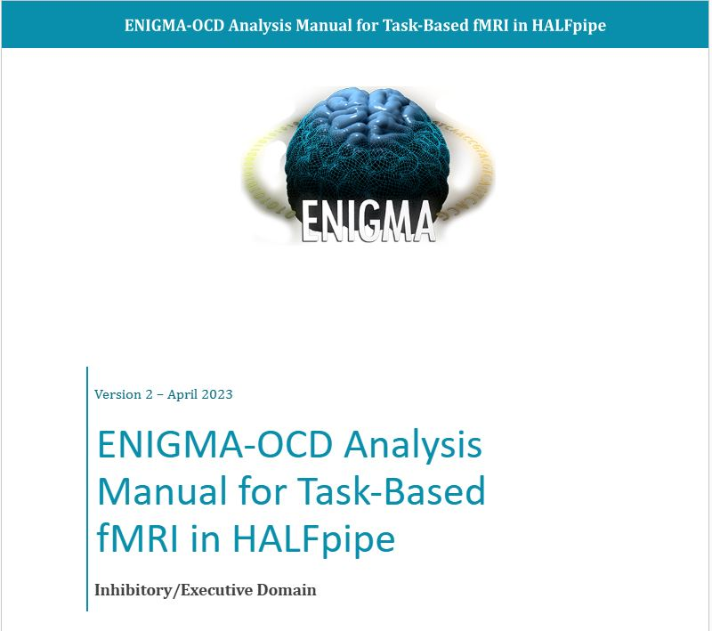
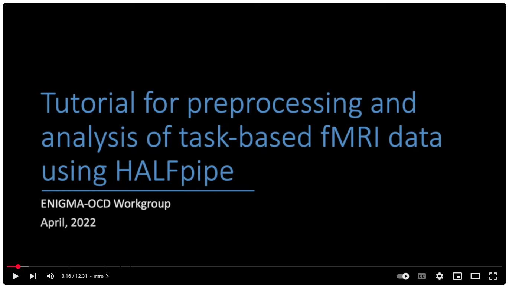
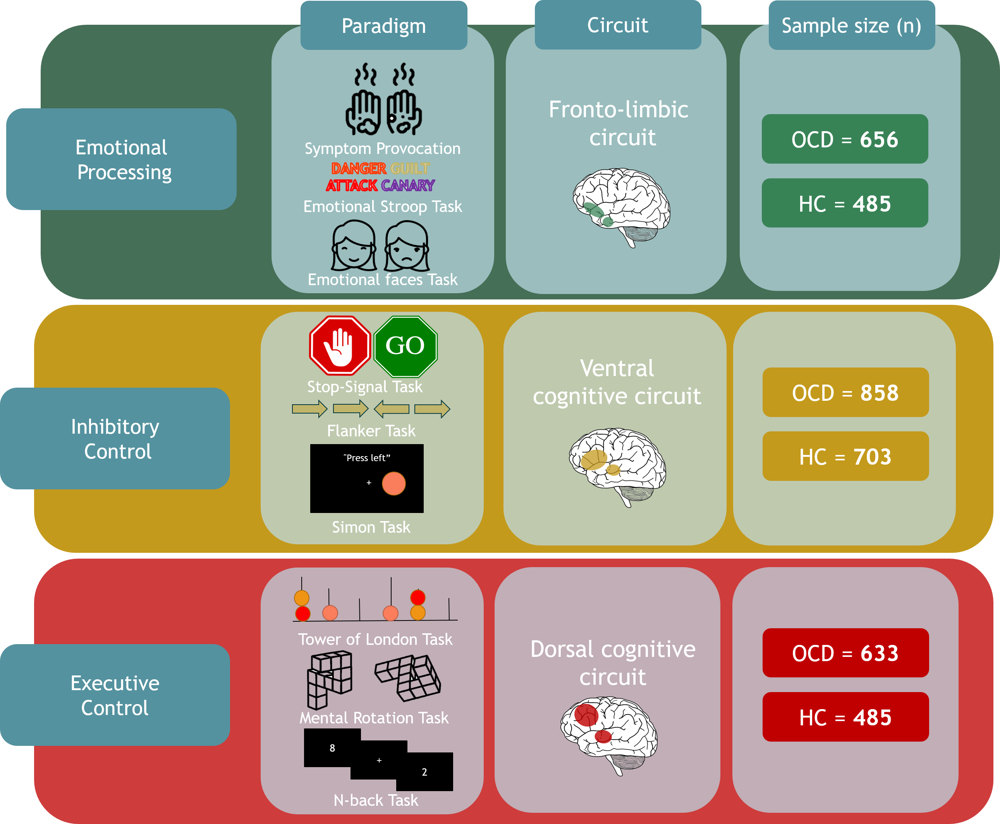
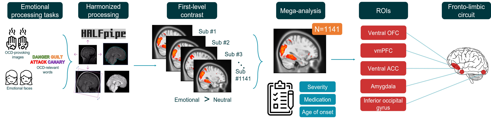
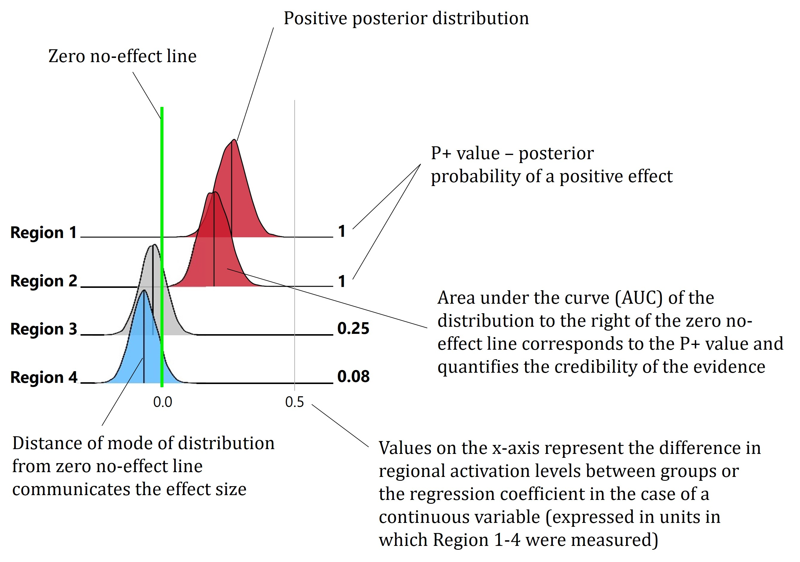
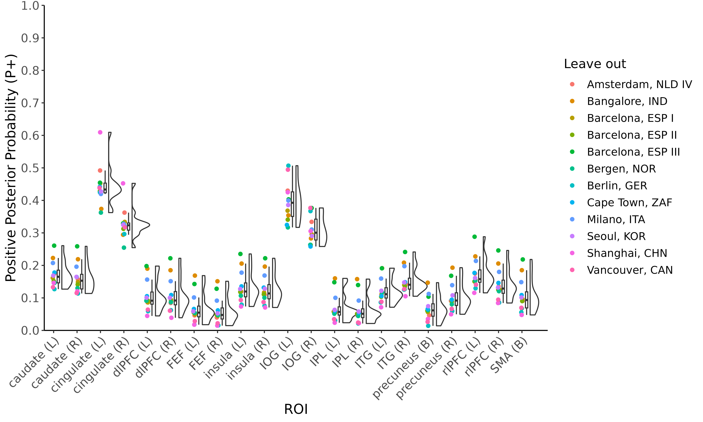
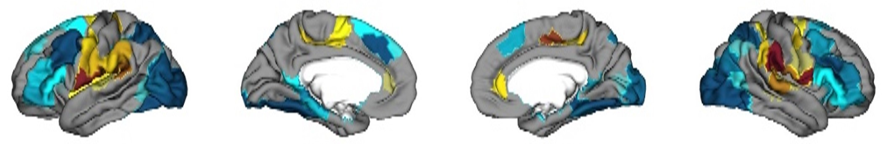
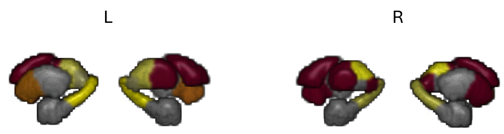

# Task-based fMRI mega-analyses in ENIGMA-OCD Working Group

This manual guides you through completing group-level analyses on individual participant task fMRI data. It was designed as a processing pipeline within the [ENIGMA-OCD consortium](https://enigma.ini.usc.edu/ongoing/enigma-ocd-working-group/). The principles of the consortium are that no raw data is shared, and that only processed and de-identified clinical and brain imaging data are shared with the lead site who carries out analyses. Therfore, this guide takes you through group-level analyses on already-processed first-level contrast maps using custom scripts and Bayesian multilevel models for regional and whole-brain analysis.

## Preprocessing

All raw data for the task-based fMRI analyses in ENIGMA-OCD has been processed using [HALFpipe](https://github.com/HALFpipe/HALFpipe) (Waller et al., 2022), an open-source containerized processing pipeline designed within the ENIGMA consortium. HALFpipe was used for pre-processing and first-level feature extraction, and was run in an identical way across all sites to ensure harmonization of data (pre)processing. The manual and acoompanying video tutorial explain how to process raw task data using HALFpipe for the ENIGMA-OCD task-based analyses.

<table align="center">
  <tr>
    <td align="center">
      <a href="https://docs.google.com/document/d/1kQ0o0olXsk6lbkQMNW7pcSofKZvyctM/edit?usp=sharing&ouid=117298130236953584298&rtpof=true&sd=true">
        
      </a><br />
      <em>Manual for HALFpipe preprocessing:</em><br />
      <a href="https://docs.google.com/document/d/1kQ0o0olXsk6lbkQMNW7pcSofKZvyctM/edit?usp=sharing&ouid=117298130236953584298&rtpof=true&sd=true">Open document</a>
    </td>
    <td align="center">
      <a href="https://www.youtube.com/watch?v=zruXn-JLE5c">
        
      </a><br />
      <em>Tutorial video for HALFpipe preprocessing:</em><br />
      <a href="https://www.youtube.com/watch?v=zruXn-JLE5c">Watch on YouTube</a>
    </td>
  </tr>
</table>

## Analyses

The analyses were intended for the three cognitive domains of the task-based analyses in ENIGMA-OCD: emotional (negative) valence, inhibitory control, and executive function. Available task data across the ENIGMA-OCD consortium was categorized into one of these three domains, each of which is subserved by a partly distinct cogntivive circuit (fronto-limbic, ventral cognitive, and dorsal cognitive). The scripts available here were designed to be compatible with the Amsterdam University Medical Center's Luna server cluster. On the Luna server, all scripts can be found in `/data/anw/anw-work/NP/projects/data_ENIGMA-OCD/ENIGMA-TASK/scripts/tb-mega-pipeline`. 

<p align="center">
  <br/>
  <em>Cognitive domains investigated in task fMRI analyses</em>
</p>

<br><br>

In the figure below the processing pipeline is depicted for one of the domains - negative emotional valence. Using the manuals linked above, the steps of `Harmonzied processing` and `First-level contrast` extraction have already taken place. This manual will explain how to use the available scripts to execute `Mega-analysis`, investigating both case-control effects and the effects of clinical characteristics of OCD, such as the age of OCD onset, medication status, and symptom severity. Region of interest (ROI) analyses in the relevant neural circuit for each domain are conducted at the group-level, as well as whole-brain analyses via two separate approaches (not pictured). We refer to these analyses as mega-analyses because we use individual-participant data when combining datasets of multiple samples, which is a different than the approach meta-analyses typically take. Meta-analyses usually rely on summary statistics at the sample level, aggregating data across samples, but not across individual participants. A huge advantage of our mega-analytic approach is that we are able to investigate the effects of participant-level variables, such as medication status or symptom severity, on brain activity in a way that meta-analyses cannot.

<p align="center">
  <br/>
  <em>Processing pipeline in task-based fMRI mega-analyses</em>
</p>


### Preparation

Some preparation is needed before scripts can be run. Because each site used their own labels for participant IDs, task names, session and run names, etc, it is necessary to standardize everything to allow it to be cobmined at the group-level analysis stage. This requires preparing some documents first:

1.	Assign 3-digit sample codes to each sample, and a new 6-digit identifier to each participant. Convert this to a key-value dictionary with two columns: the old Subj ID and the new Subj ID. Save as `Dictonary_SUB_ID.csv` file.
   
<table align="center">
  <thead>
    <tr>
      <th align="left">Original Subject ID</th>
      <th align="left">New Subject ID</th>
    </tr>
  </thead>
  <tbody>
    <tr><td>sub-MRI201905101BART002</td><td>sub-550002</td></tr>
    <tr><td>sub-MRI201905211BART003</td><td>sub-550003</td></tr>
    <tr><td>sub-MRI201905291BART005</td><td>sub-550005</td></tr>
    <tr><td>sub-MRI201906031BART006</td><td>sub-550006</td></tr>
    <tr><td>sub-MRI201906051BART007</td><td>sub-550007</td></tr>
  </tbody>
</table>
<p align="center"><em>Dictionary_SUB_ID.csv</em></p>

<br><br>

2. Compile a covariate file `RBA_input_demographics_only.csv` of all relevant clinical and demographic data per subject. In these analyes this includes, in order of columns: 1) Subject ID, 2) Sample ID, 3) Task name, 4) Diagnosis (OCD/HC), 5) Sex, 6) Age, 7) Y-BOCS symptom severity score, 8) Medication status, and 9) Age of OCD onset.
   
| Subj       | Sample   | Task   | Diagnosis  | Sex | Age | Y-BOCS | Medication Status | Age of Onset    |
|------------|----------|--------|-----|-----|-----|-------|-----|-------|
| sub-550002 | BRAGA_ER |  Symtpom provocation task | OCD | m   | 21  | 19    | Med | Child |
| sub-550003 | BRAGA_ER |  Symtpom provocation task | OCD | m   | 18  | 28    | Med | Child |
| sub-550005 | BRAGA_ER |  Symtpom provocation task | OCD | f   | 55  | 28    | Med | Adult |
<p align="center"><em>RBA_input_demographics_only.csv</em></p>

<br><br>

3.	By checking each site's HALFpipe `/derivatives/halfpipe` folder, make a mega-analytic dictionary that inventories the labels that were used at that site for first-level features including: 1) sample, 2) site, 3) site code (the one you assigned in step #2 above), 3) task, 4) the various contrasts created at the first level, and 5) the various confound-removal strategies used in the first-level analyses (in our case: 1) ICA-AROMA, 2) motion-correction with 6 rigid-body motion parameters, and 3) no correction). Save as `Mega_analysis_dictionary.csv`.
   
| Sample              | Site           | Code | Task | Contrast1_EMOgtNEUT | Contrast2_OCDgtNEUT | Contrast3_FEARgtNEUT | Contrast4__OCDgtFEAR | ICAAROMA | MOTIONCORR | NOCORR |
|:--------------------|:---------------|:-----|:-----|:-------------------|:-------------------|:--------------------|:-------------|:---------|:-----------|:-------|
| VUmc_ARRIBA_TIPICCO | van_den_Heuvel | 822  | SPT  | OCDFEARGtSCRAMBLED | OCDGtSCRAMBLED     | FEARGtSCRAMBLED     | OCDGtFEAR   | ICAAROMA | MOTIONCORR | NOCORR |
| VUmc_VENI           | van_den_Heuvel | 916  | ERT  | OCDFEARGtNEUT      | OCDGtNEUT          | FEARGtNEUT          | OCDGtFEAR   | ICAAROMA | MOTIONCORR | NOCORR |
<p align="center"><em>Mega_analysis_dictionary.csv</em></p>

<br><br>

4.	Organize HALFpipe outputs by creating one main directory containing a folder for each site. Inside each site folder, create one directory per sample and place the sample's HALFpipe folder into it.

5.	Perform quality control (QC) using the [HALFpipe QC manual](https://drive.google.com/file/d/1TMg9MRvBwZO8HB1UJmH0gm4tYaBVnvcQ/view) and create a `failed_QC.txt` that lists all participants who failed QC. If a participant fails QC for one run but not another, the data from the remaining run can still be used - in this case mention which run was excluded in the `failed_QC.txt` file. If all runs should be excluded, leave the `Runs` column empty and the participant will be entirely excluded from further analyses.

<table align="center">
  <thead>
    <tr>
      <th align="left">Subject ID</th>
      <th align="left">Runs</th>
    </tr>
  </thead>
  <tbody>
    <tr><td>sub-822011</td><td></td></tr>
    <tr><td>sub-916079</td><td>2</td></tr>
    <tr><td>sub-916081</td><td>1</td></tr>
  </tbody>
</table>
<p align="center"><em>failed_QC.txt</em></p>

<br><br>


6.	Use `1_convert_site_files_to_codes.sh` script to create a cleaned and compiled version of all HALFpipe output. This will create a new `/merged` directory containing compiled files for each contrast of interest. These files aggregate all the data needed for group-level analyses, per participant. Additionally, the script assigns new participant IDs based on the files created above, and renames all files to ensure consistent naming and directory structure.

7.	Use `2_exclude_failed_QC_subs.sh` script to exclude participants who failed QC based on `failed_QC.txt`
   
8.	Use `3_fsl_glm_to_aggregate_sessions_runs.sh` script to aggregate contrast maps across runs or sessions at the participant-level for samples that employed a task design with multiple runs or sessions. This step ensures that each participant contributes only one observation to the group-level analyses by averaging across all available runs or sessions with a simple intercept model.
   
<br><br>


### Region-of-Interest analyses

For the circuit-level analyses, we have expectations about where activation will be found based on previous meta-analyses that were done either in healthy controls or in individuals with OCD on the task domains that we investigate here. We therefore first restrict analyses to these regions to investiggate the circuits of interest before we move to whole-brain analyses.

1. Create ROI nifti images. Subcortical ROIs are created with the [Melbourne subcortical atlas](https://github.com/yetianmed/subcortex) (Tian et al., 2020) which is in the same MNI2009c asymmetrical space as HALFpipe uses. Cortical ROIs are created as 5-mm spheres around coordinates identified in literature (Thorsen et al., 2018; Nitschke et al., 2017; Norman et al., 2019). However, the coordinates from these papers were originally not in the MNI2009c asymmetrical space but rather in older MNI version 6 space, and need to be converted first. Create a `ROI_MNI6_coordinates.txt` file in which each cortical ROI and its x, y, z coordinates in MNI v. 6 space are listed.
   
<table align="center">
  <thead>
    <tr>
      <th align="left">Region</th>
      <th align="left">X</th>
      <th align="left">Y</th>
      <th align="left">Z</th>
    </tr>
  </thead>
  <tbody>
    <tr><td>LOC_l</td><td>-32</td><td>-90</td><td>-10</td></tr>
    <tr><td>LOC_r</td><td>32</td><td>-90</td><td>-10</td></tr>
    <tr><td>MTG_l</td><td>-58</td><td>-50</td><td>8</td></tr>
    <tr><td>MTG_r</td><td>58</td><td>-50</td><td>8</td></tr>
    <tr><td>vmPFC_l</td><td>-4</td><td>42</td><td>-18</td></tr>
    <tr><td>vmPFC_r</td><td>4</td><td>42</td><td>-18</td></tr>
    <tr><td>sgACC_l</td><td>-4</td><td>34</td><td>-8</td></tr>
    <tr><td>sgACC_r</td><td>4</td><td>34</td><td>-8</td></tr>
  </tbody>
</table>
<p align="center"><em>ROI_MNI6_coordinates.txt</em></p>
<br><br>

   
2. Use `4_make_spheres_MNI2009.sh` script to create nifti images of ROIs in MNI2009c asymmetrical space based on the `ROI_MNI6_coordinates.txt` file.
   
    a) If there are overlapping regions across spheres close to midline of brain:
   
    - Remove overlapping regions from lateralized spheres by multiplying spheres by corresponding hemisphere mask to get non-overlapping lateralized regions.
      ```bash
      fslmaths tpl-MNI152NLin2009cAsym_res-02_desc-brain_T1w.nii.gz -roi 0 48.5 0 -1 0 -1 0 -1 -bin leftHemisphere
      fslmaths tpl-MNI152NLin2009cAsym_res-02_desc-brain_T1w.nii.gz -roi 48.5 -1 0 -1 0 -1 0 -1 -bin rightHemisphere
      fslmaths SMA_r.nii.gz -mul leftHemisphere.nii.gz SMA_r_lateralized.nii.gz
      fslmaths SMA_l.nii.gz -mul rightHemisphere.nii.gz SMA_l_lateralized.nii.gz
      mv SMA_r_lateralized.nii.gz SMA_r.nii.gz
      mv SMA_l_lateralized.nii.gz SMA_l.nii.gz
      ```
   > 48.5 determined by taking half of dim 1 after running `fslinfo tpl-MNI152NLin2009cAsym_res-02_desc-brain_T1w.nii.gz`
   
    b) If there are overlapping regions across spheres close to one another:
   
    - Remove overlapping regions from spheres by obtaining mutually exclusive region of each sphere.
      ```bash
      fslmaths sgACC.nii.gz -mul vmPFC.nii.gz sgACC_vmPFC_intersect.nii.gz
      fslmaths sgACC.nii.gz -sub sgACC_vmPFC_intersect.nii.gz sgACC_unique.nii.gz
      fslmaths vmPFC.nii.gz -sub sgACC_vmPFC_intersect.nii.gz vmPFC_unique.nii.gz
      mv sgACC_unique.nii.gz sgACC.nii.gz
      mv vmPFC_unique.nii.gz vmPFC.nii.gz
      ```
    c) If there are multiple coordinates for a single region:

    - Cobmine regions with multiple coordinates into single image with both regions
      ```bash
      fslmaths FEF_r1.nii.gz -add FEF_r2.nii.gz FEF_r.nii.gz
      ```
      This gives both spheres the same value in the atlas file, so when extracted later the activation reflects the average of both spheres

4. Extract volumes of ROIs into `ROIs_volume.txt`. This will be used later for checking that there is sufficient signal in each ROI when extracting activation in the region.

```bash
for ROI in *.nii.gz; do
  echo "${ROI%.nii.gz}" $(fslstats ${ROI} -V >> ROIs_volume.txt
done
```
<table align="center">
  <thead>
    <tr>
      <th align="left">Region</th>
      <th align="left">Voxel Count</th>
      <th align="left">Volume (mm³)</th>
    </tr>
  </thead>
  <tbody>
    <tr><td>amygdala_l</td><td>395</td><td>3160.000000</td></tr>
    <tr><td>amygdala_r</td><td>380</td><td>3040.000000</td></tr>
    <tr><td>LOC_l</td><td>81</td><td>648.000000</td></tr>
    <tr><td>LOC_r</td><td>81</td><td>648.000000</td></tr>
    <tr><td>MTG_l</td><td>81</td><td>648.000000</td></tr>
    <tr><td>MTG_r</td><td>81</td><td>648.000000</td></tr>
    <tr><td>putamen_l</td><td>919</td><td>7352.000000</td></tr>
    <tr><td>putamen_r</td><td>940</td><td>7520.000000</td></tr>
    <tr><td>sgACC_l</td><td>72</td><td>576.000000</td></tr>
    <tr><td>sgACC_r</td><td>72</td><td>576.000000</td></tr>
    <tr><td>vmPFC_l</td><td>72</td><td>576.000000</td></tr>
    <tr><td>vmPFC_r</td><td>72</td><td>576.000000</td></tr>
  </tbody>
</table>
<p align="center"><em>ROIs_volume.txt</em></p>

<br><br>

> For visualization of ROIs on a glass brain, [BrainNetViewer](https://www.nitrc.org/projects/bnv) in Matlab is handy. Go to File > Load file > Surface file: BrainNetViewer\Data\SurfTemplateBrainMesh_ICBM152_smoothed.nv > Mapping file: 3D nifti file with all ROIs. Once loaded, go to Volume > Type selection > ROI drawing

4. Use `5_extract_activation_from_ROIs.sh` script to extract activation from ROIs.

### Whole-brain analyses

Two approaches are taken to whole-brain analyses here. Typically, when we speak of whole-brain analyses in fMRI we mean a voxel-wise analysis where a statistical model is fit to every voxel over the entire brain. However, I aimed to use Bayesian statistics for my analyses which involve many simultations over each unit of analysis, and doing this over every voxel in the brain would be too computationally expensive. Therefore a parcellated approach is taken, where activation is averaged over regions of the functionally-defined [Schaefer cortical atlas](https://github.com/ThomasYeoLab/CBIG/tree/master/stable_projects/brain_parcellation/Schaefer2018_LocalGlobal) (Schaefer et al., 2018). The 200-parcel version of the 7-network Schaefer atlas is used here. The Schaefer atlas only contains cortical areas, therefore the [Melbourne subcortical atlas](https://github.com/yetianmed/subcortex) scale 2 (32 regions) is used for subcortical regions.

This approach also has the advantage that it solves another problem of our dataset. Because our analyses include a large number of participants drawn from many different samples, the brain coverage across participants can vary substantially. By averaging activation over larger cortical regions, we can retain more participants in the analysis—even if the exact voxels imaged vary slightly between them.

1. Use `6_extract_activation_from_Schaefer_Melbourne_parcels.sh` script to extract activation from Schaefer cortical atlas parcels and Melbourne subcortical atlas regions.

The second approach to whole-brain analyses does use a voxel-wise method, [see below](#Voxel-wise-whole-brain-analyses-IBMMA-toolbox).

### Running models

For these analyses I have chosen to run a Bayesian equivalent of a multilevel model to investigate activation differences in cases and control using the [Bayesian Region-Based Analysis (RBA) toolbox](https://afni.nimh.nih.gov/pub/dist/doc/program_help/RBA.html) (Chen et al., 2019). Bayesian statistics offers several advantages over classical frequentist methods, some of which are particularly relevant for neuroimaging data like ours.First, unlike frequentist inference, which quantifies the probability of observing the data given a null hypothesis, Bayesian multilevel analysis allows us to estimate the probability of a hypothesis given the observed data. This means we can incorporate prior knowledge (even if limited) and combine it with the observed brain activations to compute the posterior probability that activations differ between individuals with OCD and healthy controls. This approach enables us to directly assess the credibility of our hypotheses. Second, rather than applying separate general linear models to each ROI, RBA jointly models all ROIs within a single hierarchical model. This approach accounts for the non-independence of brain regions within individuals, recognizing that activation patterns across regions in the same brain are more similar than those across different individuals. Third, because the multilevel model captures the inherent dependencies among brain regions within an individual, and individuals within a sample, it addresses the multiple comparisons problem directly. There is no inflation of familywise error rates, and therefore no need for post hoc correction for multiple testing. Finally, by using Bayesian statistics we promote full and transparent reporting of the results and eliminate pass/fail dichotomization based on (arbitrary) p-values. A full guide to understanding, running, and interpreting these RBA analyses, written by Aniek Broekhuizen and myself, can be found [here](https://docs.google.com/document/d/1kQ0o0olXsk6lbkQMNW7pcSoqfKZvyctM/edit?usp=sharing&ouid=117298130236953584298&rtpof=true&sd=true).

1. Create input files for Bayesian ROI analyses. These input files consist of extracted activation from ROIs (done above) as well as demographic and clinical variables that should be in the `RBA_input_demographics_only.csv` file above. Individual input files for each model are created by the `7_create_RBA_input_models.R` script.

#### ROI models

For each contrast of interst, group-level models are run for the following: 
1) Intercept model to assess task effects
2) Case-control effect
3) Effect of medication status
4) Effect of age on OCD onset
5) Effect of OCD symptom severity
   
1. Use `8-1b_submit_sbatch_RBA_ROI.sh` wrapper script to run these models - the script calls the RBA syntax script `8-1a_syntax_RBA_ROI.sh`. 

All models include a random intercept for sample (to control for site effects like which MRI scanner was used), as well as age and sex as covariates of no interest. 

#### Whole-brain models

The same models are run for the whole-brain parcellations as for the ROI analyses.

1. Use `8-3b_submit_sbatch_RBA_whole-brain.sh` wrapper script, which calls the RBA syntax script `8-3a_syntax_RBA_whole-brain.sh`.

*Note:* The maximum length of a single job on the Luna server is 7 days (when using the `luna-cpu-long` partition) - the whole-brain sbatch script is therefore also set to 7 days as the whole-brain models with 200 Schaefer parcellations took about 5.5 days to run.

#### Sensitivity analyses

While we control for site effects using sample as a random intercept, we also want to run a separate sensitivity analysis for the ROI analyses by removing one sample at a time and running the same models to check whether any samples have a large effect on the results. 

1. Use `8-2b_submit_sbatch_RBA_ROI_jackknife.sh` wrapper script, which calls `8-2a_syntax_RBA_ROI_jackknife.sh`, to run leave-one-sample-out analyses for each model. I did this on the main contrast of interest for each domain (or main two contrasts in the negative emotional valence domain) as the other contrasts of interest already represented a sub-group of all samples. 


### Visualizing results

#### ROI ridge plots

The Bayesian RBA tool outputs it's own visualization of regional effects for each ROI as a ridge plot. We improve slightly on these ridge plots by alphabetizing the ROIs (making it easier to compare different models or contrasts side-by-side), and and modifying the color bar to make the regions in which there is evidence for differences slightly more salient, and suppress coloring regions in which there is weak or no evidence of differences.

1.	Use `9b_improve_RBA_ridge_plots_ROI.R` script which calls `alphabet_ridge.R` function to remake all figures for ROI analyses. The `9b_improve_RBA_ridge_plots_ROI.R` script optionally takes a range of P+ values from the leave-one-sample-out sensitivity analyses performed above, which is created using the `9a_ROI_jackknife_raincloud_plots.R` script below. 

<p align="center">
  <br/>
  <em>Example of ROI activation ridge plot</em>
</p>

Consider a hypothetical analysis of the effects in four regions. In Regions 1 and 2 there is very strong evidence of a positive effect as the entire AUC is to the right of the no-effect line (P+=1.0), denoting a nearly 100% probability of the effect being positive in these regions. Region 1 has a larger effect size than Region 2 as the mode of the distribution is further away from the no-effect line. In Region 4 there is moderate evidence for a negative effect as AUC is largely to the left of the no-effect line (P+=0.08). Small values of P+ convey evidence that the effect is negative – a P+ value of 0.08 indicates that the probability of the effect being positive is only 8%, so the probability of it being negative is 92%. For Region 3, the distribution crosses the no-effect line with 25% of the AUC to the right of the no effect line (P+=0.25), meaning there is no strong evidence of a positive effect, but also no strong evidence of a negative effect in this region. 

#### Leave-one-sample-out raincloud plots  

1. Use `9a_ROI_jackknife_raincloud_plots.R` script which calls `raincloud_plot.R` function to create raincloud plots of leave-one-sample-out sensitivity analysis for ROI effects. The raincloud plots visualize how the P+ value changes for each ROI as one sample at a time is removed from analysis. This script also creates a P+ range file for each model and contrast in the format `{contrast}_{model}_P_plus_range.csv` that is needed for script `9b_improve_RBA_ridge_plots_ROI.R` above.

<p align="center">
  <br/>
  <em>Example of raincloud plot for leave-one-sample-out sensitivity analysis</em>
</p>

<br><br>      

<table align="center">
  <thead>
    <tr>
      <th align="left">ROI</th>
      <th align="left">Min_P</th>
      <th align="left">Max_P</th>
    </tr>
  </thead>
  <tbody>
    <tr><td>caudate (L)</td><td>0.13</td><td>0.26</td></tr>
    <tr><td>caudate (R)</td><td>0.11</td><td>0.26</td></tr>
    <tr><td>cingulate (L)</td><td>0.36</td><td>0.61</td></tr>
    <tr><td>cingulate (R)</td><td>0.25</td><td>0.45</td></tr>
    <tr><td>dlPFC (L)</td><td>0.04</td><td>0.20</td></tr>
    <tr><td>dlPFC (R)</td><td>0.04</td><td>0.22</td></tr>
  </tbody>
</table>
<p align="center"><em>P_plus_range.csv</em></p>

<br><br>

#### Cortical whole-brain figures

1.	Use `9c_improve_RBA_ridge_plots_whole-brain.R` script to make Bayesian RBA ridge plots in alphabetical order.
   
2.	Use `9d_extract_P_plus_values_SchaeferMelbourne_from_RBA_output.R`script to extract P+ values from RBA analyses for each parcellated cortical brain region. 

3.	To visualize cortical activation using [ENIGMA toolbox](https://enigma-toolbox.readthedocs.io/en/latest/index.html), use `9e_enigma-toolbox-RBA_Schaefer200.py` script. The ENIGMA toolbox maps the parcellated activation's P+ values to a flattened surface space.  

<p align="center">
  <br/>
  <em>Example of cortical activation figure using ENIGMA Toolbox</em>
</p>

<br><br>   
   
#### Subcortical region figures

1. Use `9f_create_3D_niftis_RBA_Melbourne32.sh` script to create a 3D nifti file of the 32 regions in the Melbourne subcortical atlas where each region has it’s corresponding P+ value.
  
2. To visualize subcortical activation, open [MRIcroGL](https://www.nitrc.org/projects/mricrogl). Open Scripting, then copy-paste `9g_MRIcroGL_render.py` script into the window and run with command+R. The `rbacol.clut` file must be in the `Resources\lut` folder of MRIcroGL. This will create a screenshot of the medial and lateral views of the subcortex for each model.
   
    *Note:* MRIcroGL will not work on Luna, therefore you must open it on your own laptop or on the remote desktop using the Remote Desktop Connection app in One View (Computer: 10.119.129.24). Before using the remote desktop, you must be given access to it first. 

<p align="center">
  <br/>
  <em>Example of subcortical activation figure using MRIcroGL</em>
</p>

<br><br>

### Frequentist statistics

1. Use `9h_frequentist_multilevel.R` script to run frequentist equivalent of Bayesian multilevel models as a comparison. 

### Demographics

1.	Use `10_demographic_tables_and_task_perf.R` script to analyze demographic statistics and task performance.

## Voxel-wise whole-brain analyses: IBMMA-toolbox

A new method was developed within ENIGMA specifically for mega-analyses of multi-cohort datasets at a voxel level by Delin Sun in his [IBMMA toolbox](https://github.com/sundelinustc/IBMMA/tree/2024-10-21). It is called IBMMA (Image-Based Meta- & Mega-Analysis) precicely because it is designed to take whole-brain statistical map images and apply mass-univariate statistical models to diverse neuroimaging features, including voxel-based functional brain measures. Using IBMMA requires very little extra preparation after the above steps have been executed, and produces whole-brain voxel-wise group-level results that can be used to enrich the [parcellated whole-brain approach](#whole-brain-analyses) above.

1.	Open a large interactive slurm session (I used 24 CPUs and 50GB RAM)
2.	Download entire [IBMMA github repository](https://github.com/sundelinustc/IBMMA/tree/2024-10-21) and unzip it
3.	Prepare `path_para.xlsx` file according to instructions in the file. See [path_para.xlsx](files/path_para.xlsx) for an example.
4. Prepare covariates file
   
    a. Covariate file must have first column `fID` with following structure: sample_subject
   
    - Since our sample directory is named `halfpipe` for each contrast of interest in each domain, this should be for example: `halfpipe_sub-916001`
     	  	
    b.	Covariate file should have no string variables, all string variables should be converted to numerical, including `sample`. If this has not been done, ensure the `predictors` sheet of the `path_para.xlsx` file contains a mapping of string variables to numeric values.

| fID                | Subject     | Sample     | TASK | DX  | YBOCS | AGE | SEX | AO    | MED  |
|--------------------|--------------|------------|------|-----|--------|-----|-----|-------|------|
| halfpipe_sub-157001 | sub-157001   | 1 | TOL  | OCD | 28     | 42  | m   | Adult | Unmed |
| halfpipe_sub-157002 | sub-157002   | 1 | TOL  | HC  |        | 39  | m   | HC    | HC    |
| halfpipe_sub-157003 | sub-157003   | 1 | TOL  | OCD | 36     | 36  | f   | Adult | Med   |

<br><br>

5.	Load modules needed:
    ```bash
    Anaconda3 
    module load R
    module load rstudio
    ```

6. Open rstudio (type rstudio & in terminal) and install this R package first: 
install.packages('pacman')
ii.	install these R packages next:
library(pacman)
packages <- c('devtools','oro.nifti','RNifti')
do.call(p_load, as.list(packages))
install.packages("remotes")
library(remotes)
remotes::install_github("spisakt/pTFCE@v0.2.2.1")
iii.	based on error messages as toolbox runs, it may be necessary to install other packages into home/anw/username/R/x86_64-pc-linux-gnu-library/4.4 using same method as above
b.	raise maximum number of network sockets open simultaneously
ulimit -n 5000 
6)	Adjust R_modelling_parallel.R script to limit number of cores to slightly below number that the slurm session has, in 2 places in the script:
cl <- makeCluster(cores)  --> cl <- makeCluster(20)  
cl <- makeCluster(num_cores) --> cl <- makeCluster(20)
7)	Adjust R_modelling_parallel.R script to remove one variable being written 
foreach(i = 1:dim(term_cols)[1], .packages = packages) %dopar% {save_data <-save_data(term_cols[i,]) } -->  foreach(i = 1:dim(term_cols)[1], .packages = packages) %dopar% {save_data(term_cols[i, ])  }
8)	load python environment
a.	conda activate myenv
i.	There may be a number of packages that need to be installed, this will be signaled by errors in running the ibmma.py script and can be done with
1.	pip install <package>
9)	Run ibmma.py script 
a.	python ibmma.py

    


## Missing data

To help identify missing data the scripts output files that help identify the reasons for which participants were excluded from analyses, or which data is missing. There are four types of excluded participants/data:
1. Participants excluded due to failing quality control checks - visible in `failed_QC.txt`
2. Participants excluded due to too much motion (framewise displacement >1.0) - visible in `failed_FD1.0.txt` 
3. Participants for who a portion of the first-level processing pipeline failed to run, for example the ICA-AROMA confound removal - visible in `failed_ICA.txt`
4. Participants who have missing data for some brain regions due to having <30% of the ROI/parcel volume in the field of view  - visible in `insufficient_volume_ROIs.txt` for defined ROIs and `insufficient_volume_parcels.txt` for Schaefer/Melbourne parcellated atlas regions

All these files will be written to the `/merged` directory's contrast-of-interest folders (except `failed_QC.txt` which is made in Preparation step #5 above), making it easy to inspect output.


## Publications using this pipeline

Dzinalija, N., Vriend, C., ENIGMA-OCD Consortium, … , Veer, I., van den Heuvel, O. A. (2024). Negative valence in Obsessive-Compulsive Disorder: A worldwide mega-analysis of task-based functional neuroimaging data of the ENIGMA-OCD consortium. Biological psychiatry, S0006-3223(24)01819-5. 

Dzinalija, N., Veer, I., ENIGMA-OCD Consortium, … , van den Heuvel, O. A., Vriend, C. (2025). Executive control in Obsessive-Compulsive Disorder: A worldwide mega-analysis of task-based functional neuroimaging data of the ENIGMA-OCD consortium. https://osf.io/ebtpk

Dzinalija, N.,  van den Heuvel, O. A., ENIGMA-OCD Consortium, … , Vriend, C., Veer, I. (2025). Inhibitory control in OCD: A mega-analysis of task-based fMRI data of the ENIGMA-OCD consortium. https://osf.io/mhq8t


## References

Chen, G., Xiao, Y., Taylor, P. A., Rajendra, J. K., Riggins, T., Geng, F., Redcay, E., & Cox, R. W. (2019). Handling Multiplicity in Neuroimaging Through Bayesian Lenses with Multilevel Modeling. Neuroinformatics, 17(4), 515-545.

Schaefer A, Kong R, Gordon ME, Laumann OT, Zuo X-N, Holmes JA, et al. Local-Global Parcellation of the Human Cerebral Cortex from Intrinsic Functional Connectivity MRI. Cerebral Cortex. 2018;28(9):3095-114.

Tian Y, Margulies SD, Breakspear M, Zalesky A. Topographic organization of the human subcortex unveiled with functional connectivity gradients. Nature Neuroscience. 2020;23(11):1421-32.

van den Heuvel, O. A., Boedhoe, P., Bertolin, S., Bruin, W. B., Francks, C., Ivanov, I., Jahanshad, N., Kong, X. Z., Kwon, J. S., O'Neill, J., Paus, T., Patel, Y., Piras, F., Schmaal, L., Soriano-Mas, C., Spalletta, G., van Wingen, G. A., Yun, J. Y., Vriend, C., Simpson, H. B., … ENIGMA-OCD working group (2022). An overview of the first 5 years of the ENIGMA obsessive-compulsive disorder working group: The power of worldwide collaboration. Human Brain Mapping, 43(1), 23–36. 

Waller, L., Erk, S., Pozzi, E., Toenders, Y. J., Haswell, C. C., Büttner, M., Thompson, P. M., Schmaal, L., Morey, R. A., Walter, H., & Veer, I. M. (2022). ENIGMA HALFpipe: Interactive, reproducible, and efficient analysis for resting-state and task-based fMRI data. Human Brain Mapping, 43(9), 2727– 2742.


