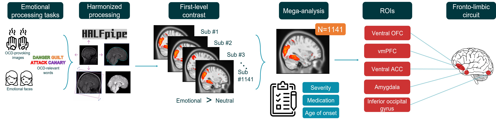

# Task-based fMRI mega-analyses in ENIGMA-OCD Working Group

This manual guides you through completing group-level analyses on individual participant task fMRI data. It was designed as a processing pipeline within the [ENIGMA-OCD consortium](https://enigma.ini.usc.edu/ongoing/enigma-ocd-working-group/). The principles of the consortium are that no raw data is shared, and that only processed and de-identified clinical and brain imaging data are shared with the lead site who carries out analyses. Therfore, this guide takes you through group-level analyses on already-processed first-level contrast maps using custom scripts and Bayesian multilevel models for regional and whole-brain analysis.

## Preprocessing

All raw data for the task-based fMRI analyses in ENIGMA-OCD has been processed using [HALFpipe](https://github.com/HALFpipe/HALFpipe) (Waller et al., 2022), an open-source containerized processing pipeline that was used for pre-processing and first-level feature extraction. The manual and acoompanying video tutorial explain how to process raw task data using HALFpipe for the ENIGMA-OCD task-based analyses.

  

  <em>Manual for HALFpipe preprocessing:</em> 
  <a href="https://www.youtube.com/watch?v=zruXn-JLE5c">Open document</a>

  

  

  <em>Tutorial video for HALFpipe preprocessing:</em> 
  <a href="https://www.youtube.com/watch?v=zruXn-JLE5c">Watch on YouTube</a>

## Analyses

The analyses were intended for the three cognitive domains of the task-based analyses in ENIGMA-OCD: emotional (negative) valence, inhibitory control, and executive function. Available task data across the ENIGMA-OCD consortium was categorized into one of these three domains, each of which is subserved by a partly distinct cogntivive circuit (fronto-limbic, ventral cognitive, and dorsal cognitive). The scripts available here were designed to be compatible with the Amsterdam University Medical Center's Luna server cluster. On the Luna server, all scripts can be found in `/data/anw/anw-gold/NP/projects/data_ENIGMA-OCD/ENIGMA-TASK/scripts/tb-mega-pipeline`. 

   
  <em>Cognitive domains investigated in task fMRI analyses</em>

Some preparation is needed before scripts can be run.

1.	Assign 3-digit site codes to each site, and a new 6-digit number to each subject, in Site_codes.xslx file. Save as .csv. 

2.	Convert to a key-value dictionary, in Dictonary_SUB_ID.xlsx file

3.	Make mega-analytic dictionary with names of features, tasks, contrasts, etc per sample, in Mega_analysis_dictionary.xlsx file. Save as .csv.

4.	Consolidate all site halfpipe output in one folder, named by site, then sample dir underneath

5.	Use 1_convert_site_files_to_codes.sh script to convert original sub IDs to new assigned 6-digit identifiers and to write all files needed to specific contrasts in /merged dir

6.	Use 2_exclude_failed_QC_subs.sh to exclude subjects/runs which failed QC based on failed_QC.txt (same for both contrasts) that was prepared first in Excluded_data.xlsx 

7.	For samples that had multiple runs/sessions, run 3_fsl_glm_to_aggregate_sessions_runs.sh script

   
  <em>Processing pipeline in task-based fMRI mega-analyses</em>

## Publications using this pipeline

Dzinalija, N., Vriend, C., Waller, L., Simpson, H. B., Ivanov, I., Agarwal, S. M., Alonso, P., Backhausen, L. L., Balachander, S., Broekhuizen, A., Castelo-Branco, M., Costa, A. D., Cui, H., Denys, D., Duarte, I. C., Eng, G. K., Erk, S., Fitzsimmons, S. M. D. D., Ipser, J., Jaspers-Fayer, F., … van den Heuvel, O. A. (2024). Negative valence in Obsessive-Compulsive Disorder: A worldwide mega-analysis of task-based functional neuroimaging data of the ENIGMA-OCD consortium. Biological psychiatry, S0006-3223(24)01819-5. 

-Exec paper OSF link
-Inhib paper OSF link

## References

Chen, G., Xiao, Y., Taylor, P. A., Rajendra, J. K., Riggins, T., Geng, F., Redcay, E., & Cox, R. W. (2019). Handling Multiplicity in Neuroimaging Through Bayesian Lenses with Multilevel Modeling. Neuroinformatics, 17(4), 515-545.

van den Heuvel, O. A., Boedhoe, P., Bertolin, S., Bruin, W. B., Francks, C., Ivanov, I., Jahanshad, N., Kong, X. Z., Kwon, J. S., O'Neill, J., Paus, T., Patel, Y., Piras, F., Schmaal, L., Soriano-Mas, C., Spalletta, G., van Wingen, G. A., Yun, J. Y., Vriend, C., Simpson, H. B., … ENIGMA-OCD working group (2022). An overview of the first 5 years of the ENIGMA obsessive-compulsive disorder working group: The power of worldwide collaboration. Human Brain Mapping, 43(1), 23–36. 

Waller, L., Erk, S., Pozzi, E., Toenders, Y. J., Haswell, C. C., Büttner, M., Thompson, P. M., Schmaal, L., Morey, R. A., Walter, H., & Veer, I. M. (2022). ENIGMA HALFpipe: Interactive, reproducible, and efficient analysis for resting-state and task-based fMRI data. Human Brain Mapping, 43(9), 2727– 2742.
-Chen paper

